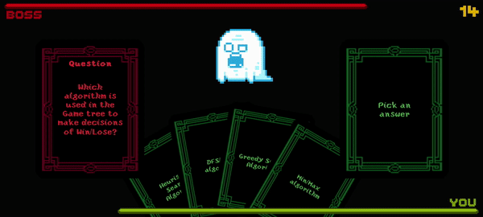

# Dungeon Learners
[[Video](https://youtu.be/yRan1s2Mn9s)]

This repository contains the Unity project code of an educational card battle game for the module CZ3003 Software Systems Analysis and Design.

## Downloading the App
A mobile android APK of the app can be obtained by downloading and unzipping `DungeonLearners/APKBuild.zip`.

## Accessing the Project Code
Clone the repository and import the folder `DungeonLearners` into Unity Hub.
